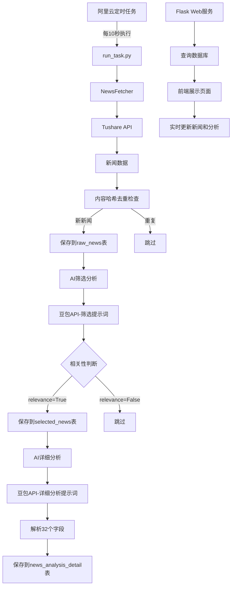

# 金融新闻分析系统实施计划

## 系统架构




## 项目结构

```javascript
financial-news-analysis/
├── app.py                 # Flask Web应用主文件
├── config.py              # 配置文件（数据库、API密钥等）
├── models.py              # 数据库模型定义
├── news_fetcher.py        # 新闻采集模块
├── news_filter.py         # AI筛选模块
├── news_analyzer.py       # AI详细分析模块
├── run_task.py            # 定时任务入口脚本
├── utils.py               # 工具函数（去重、相似度计算等）
├── requirements.txt       # Python依赖包
├── README.md              # 部署说明文档
├── templates/             # Flask模板目录
│   └── index.html         # 新闻展示页面
└── static/                # 静态资源目录
    ├── css/
    │   └── style.css      # 样式文件
    └── js/
        └── main.js        # 前端JavaScript
```

## 核心模块设计

### 1. 数据库设计 (`models.py`)

根据提供的数据库设计，系统包含三个表：**raw_news表（原始新闻数据）：**

- id, title, content, news_datetime, source, create_time, content_hash
- 存储从Tushare获取的所有原始新闻数据

**selected_news表（筛选后新闻）：**

- id, title, content, news_datetime, source, create_time, relevance, direction, impact, content_hash
- 存储通过AI筛选后判定为相关的新闻（relevance=True）
- direction: 短期影响方向（int）
- impact: 短期影响程度（int）

**news_analysis_detail表（完整分析结果）：**

- 包含所有32个字段
- 参数类字段（7-19）：relevance, direction, impact, interest_direction, interest_impact, dollar_direction, dollar_impact, warrisk_direction, warrisk_impact, liquidity_direction, liquidity_impact, emotion_direction, emotion_impact
- 关键词和参考：keyword（array）, Reference（array）
- 分析类字段（22-26）：interest, dollar, warrisk, liquidity, emotion
- 结论类字段（27-31）：shorttime, midtime, longtime, insight, conclusion
- content_hash: 用于关联raw_news和selected_news

### 2. 新闻采集模块 (`news_fetcher.py`)

- 连接Tushare Pro API获取新闻（华尔街见闻快讯、新浪财经）
- 计算content_hash（基于title+content）
- 检查raw_news表中是否已存在相同content_hash
- 将新新闻保存到raw_news表
- 返回新增新闻列表（用于后续分析）

### 3. AI筛选模块 (`news_filter.py`)

- 从raw_news表中获取未筛选的新闻（通过content_hash关联检查selected_news）
- 调用豆包API使用筛选提示词进行相关性判断
- 解析返回结果，提取relevance, direction, impact字段
- 将relevance=True的新闻保存到selected_news表

### 4. AI详细分析模块 (`news_analyzer.py`)

- 从selected_news表中获取未详细分析的新闻（通过content_hash关联检查news_analysis_detail）
- 调用豆包API使用详细分析提示词
- 解析AI返回的JSON结果，提取所有32个字段
- 将完整分析结果保存到news_analysis_detail表

### 5. 定时任务脚本 (`run_task.py`)

- 可独立执行的脚本，支持阿里云定时命令调用
- 执行流程：

1. 调用news_fetcher获取新新闻，保存到raw_news
2. 对raw_news中的新新闻调用news_filter进行筛选，保存到selected_news
3. 对selected_news中的新新闻调用news_analyzer进行详细分析，保存到news_analysis_detail

- 完善的错误处理和日志输出
- 支持断点续传（通过content_hash判断已处理数据）

### 6. Web展示系统 (`app.py` + `templates/index.html`)

- Flask后端提供RESTful API接口：
- `/api/news` - 获取最新新闻列表（从news_analysis_detail表）
- `/api/news/<id>` - 获取单条新闻的完整分析
- `/api/stats` - 获取统计信息（新闻数量、分析进度等）
- 前端页面实时展示：
- 新闻列表（标题、来源、发布时间）
- 核心结论（conclusion）
- 投资启示（insight）
- 短期/中期/长期结论
- 各维度分析（实际利率、美元指数、地缘政治风险等）
- 使用AJAX定时刷新最新数据（每10-30秒）
- 美观的金融新闻展示界面，支持筛选和搜索

### 6. 配置文件 (`config.py`)

- 数据库连接配置（RDS MySQL）
- Tushare Token配置
- 豆包API密钥配置
- 其他系统参数

## 技术实现要点

1. **内容去重算法**：使用content_hash（MD5或SHA256）基于title+content计算，快速判断重复
2. **数据库连接**：使用pymysql或SQLAlchemy连接MySQL，配置连接池
3. **数据流转**：通过content_hash关联三个表，确保数据一致性
4. **AI提示词**：需要准备两个提示词模板

- 筛选提示词：判断新闻相关性，输出relevance、direction、impact
- 详细分析提示词：输出完整的32个字段（JSON格式）

1. **结果解析**：AI返回结果需要解析为结构化数据，处理数组类型字段（keyword、Reference）
2. **错误处理**：完善的异常处理和日志记录，API调用失败重试机制
3. **并发安全**：确保定时任务并发执行时的数据一致性，使用数据库事务

## 部署步骤

1. 在ECS上创建项目目录
2. 安装Python依赖（requirements.txt）
3. 配置config.py文件（填入实际密钥和连接信息）
4. 初始化数据库表结构
5. 配置阿里云定时任务（每10秒执行run_task.py）
6. 启动Flask Web服务（使用gunicorn或supervisor）
7. 配置Nginx反向代理（可选）

## 注意事项

- 配置文件包含敏感信息，需要妥善保管
- 定时任务频率较高（10秒），注意API调用限制

